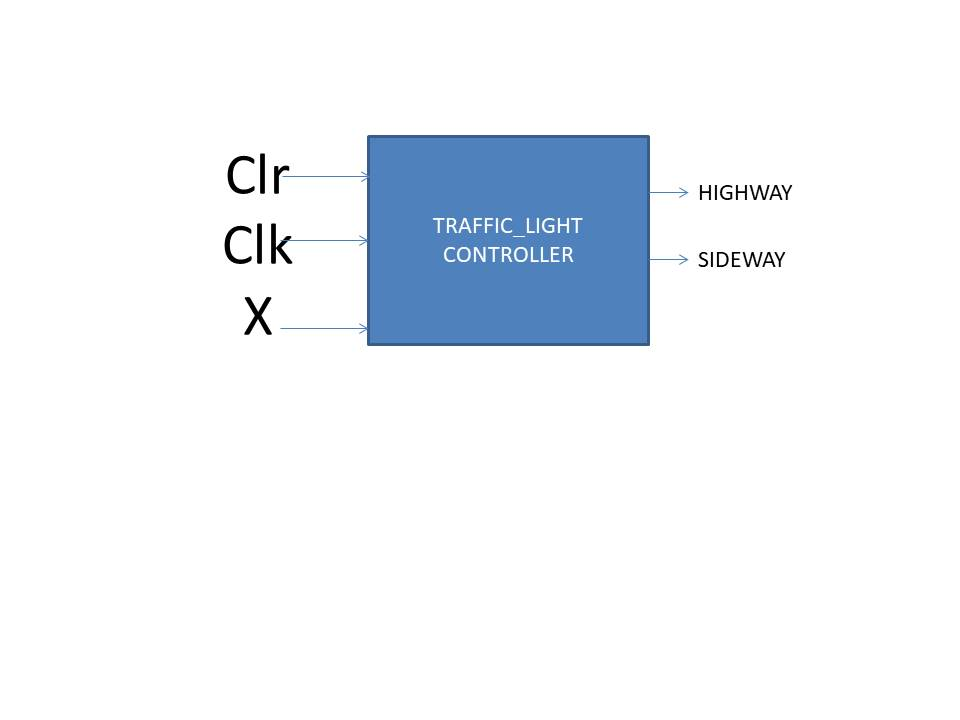
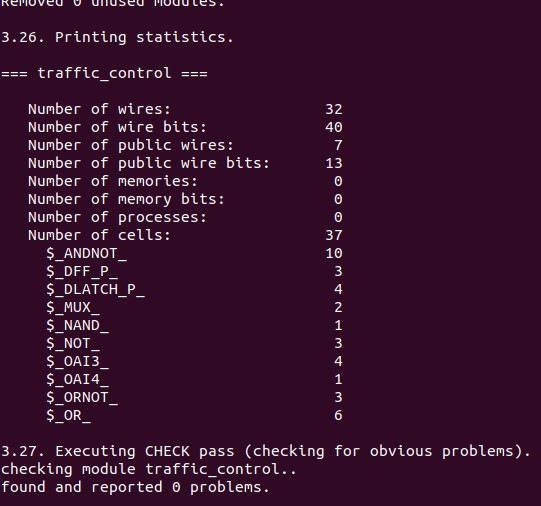

# Traffic-light-controller
- Design of FSM Basd variable Timer Traffic light Controller.
- here we a going to do this taking three scenarios<br /> 
  1 .Highway and a Sideway(with sensor stimulus)<br />
  2 .T-Junction(timer based)<br />
  3 .four-way with Sensors.<br />
# First Will implement Highway and Sideway:
<p align="center">
  
</p>

## Blockdiagram:
 
 <p align="center">
   
 </p>

## State diagram:
 
 <p align="center">
   
 </p>
 
##  Verilog code:
  
  ```
  
     `define true   1'b1
     `define false  1'b0
     `define red    2'd0
     `define amber  2'd1
     `define green  2'd2

     // state transation   hw            sw
     `define s0    3'd0 //green         red 
     `define s1    3'd1 //amber         green  
     `define s2    3'd2 //red           red
     `define s3    3'd3 //red           green     
     `define s4    3'd4 //red           amber

      //delay's
     `define a2rdelay  5
     `define r2gdelay  3

      module traffic_control(output [1:0] hw,
                       output [1:0] sw,
                       input x,
                       input clr,
                       input clk);

    reg [1:0] hw,sw;
    reg [2:0]ps;
    reg [2:0]ns;

    // Boundary conditions
    initial 
    begin  
     ps= `s0;
     ns= `s0;
     hw= `green;
     sw= `red;
    end 

   always @(posedge clk)
    ps=ns;
   
   
    always @(ps)
    begin 
    case(ps)
     `s0: begin 
           hw= `green;
           sw= `red;
          end 
   `s1: begin 
         hw= `amber;
         sw= `red;
        end 
   `s2:  begin 
          hw= `red;
          sw= `red;
       end
   `s3:  begin 
         hw= `red;
         sw= `green;
       end  
   `s4:  begin 
         hw= `red;
         sw= `amber;
        end
   endcase
  end
  // state machine with case statements
  always @(ps or clr or x)
  begin 
   if (clr)
   ns= `s0;
   else
   case(ps)
    `s0: if(x)
         ns= `s1;
        else
         ns= `s0;      
    `s1: begin //delay some positive edges of clock
           repeat(`a2rdelay) 
           ns = `s2;
          end
    `s2: begin //delay some positive edges of clock
            repeat(`r2gdelay) 
           ns = `s3;
          end
    `s3:  if(x) // check for the status of lanes
           ns = `s3;
         else
          ns = `s4;
          
    `s4: begin //delay some positive edges of clock
           repeat(`a2rdelay) 
           ns = `s2;
          end
     default: ns = `s0;
    endcase 
   end 
  endmodule
  
  ```
##  Synthesis:

 <p align="center">
   
 </p>

##  Test-bench:
