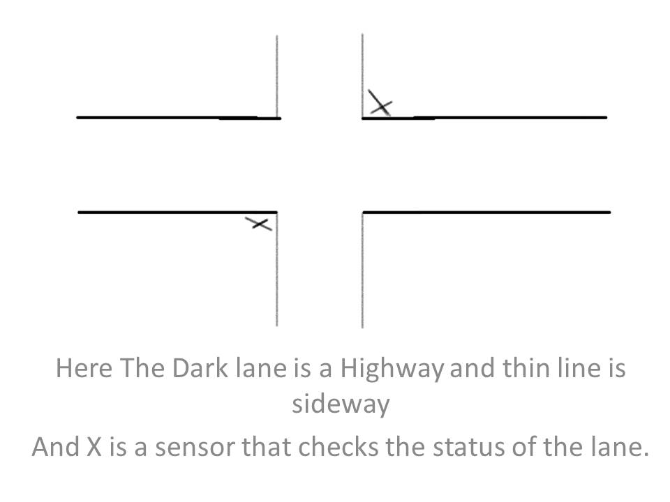

# Traffic-light-controller
- Design of FSM Basd variable Timer Traffic light Controller.
- here we a going to do this taking three scenarios 
  1 .Highway and a Sideway(with sensor stimulus)
  2 .T-Junction(timer based)
  3 .four-way with Sensors.
# First Will implement Highway and Sideway:
<p align="center">
  
</p>
# blockdiagram
<p align="center">
  
</p>
# verilog code:
 ```
 ```
# Synthesis:
<p align="center">
  
</p>
